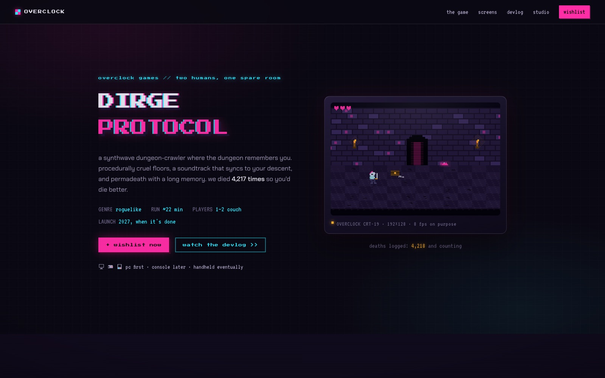

<!-- parable:beautified -->
<div align="center">

<h1>Overclock</h1>

<p><strong>Indie roguelike studio — procedural canvas pixel art + CRT pipeline.</strong></p>

<p>
  <a href="https://bswxyz.github.io/overclock-games/"></a>
  
  
  <a href="LICENSE"></a>
</p>

<p>
  <a href="https://bswxyz.github.io/overclock-games/"><b>Live demo</b></a>
  &nbsp;·&nbsp;
  <a href="https://bswxyz.github.io/overclock-games/guide/">Build notes</a>
  &nbsp;·&nbsp;
  <a href="https://parable-three.vercel.app/templates">More templates</a>
</p>

<a href="https://bswxyz.github.io/overclock-games/">
  
</a>

</div>

**Use this template** — copy the source into a new project:

```bash
npx degit bswxyz/overclock-games my-app
```


Launch page for a (fictional) two-person indie studio and its synthwave dungeon-crawler
roguelike — with a live procedural pixel-art renderer instead of key art, and zero
dependencies — part of the [Parable 25 design showcase](https://parable-three.vercel.app).

---

## The concept

OVERCLOCK is a two-person roguelike studio launching DIRGE PROTOCOL: procedurally cruel
floors, permadeath with a memory, couch co-op, a synthwave OST. The site's bet is that an
indie studio's best marketing is its craft, so the page *is* the demo: the hero "key art" is
a live canvas dungeon (a knight patrolling at 8 fps, on purpose), the screenshots are the
same renderer in four biome palettes, and the devlog types its own patch notes in a VT323
terminal. Voice is dev-to-player and wry — "we died 4,217 times so you'd die better."

Layout follows three shipped patterns researched on Mobbin: the streaming-title hero
(logo lockup + metadata strip + loud/quiet CTA pair — Netflix Games/HBO Max/Analogue), a
store page's version-numbered "latest updates" promoted to a full devlog section
(Amazon/Slack/Linear changelog anatomy), and a thumbnail-rail screenshot gallery
(Unity Asset Store).

## Design system

- **Palette (chiptune CRT):** `--bg:#0a0812` near-black · `--ink:#e8e4f0` ·
  `--dim:#a89fc0` · `--faint:#665e80` · `--magenta:#ff2ea6` · `--cyan:#29e6ff` ·
  `--amber:#ffb02e` (rare — torches, god mode) · `--line:rgba(232,228,240,.12)`.
  Magenta and cyan split the page like a chromatic aberration; amber is scarcity.
- **Type:** `Press Start 2P` (bitmap display — used deliberately small; it's illegible
  large) · `Chakra Petch` (squarish techno grotesque, headlines + body) · `VT323`
  (terminal mono, devlog + metadata). No other site in the series shares this trio.
- **Signature motion:** a smooth settle `cubic-bezier(.12,.8,.16,1)` paired with a chunky
  `steps(5,end)` — hovers, reveals, LED blinks and the cursor all snap through frames like
  a sprite sheet. Counters update at ~14fps instead of tweening.
- **CRT pipeline:** scanline overlays (global + per-bezel), barrel vignette, glass sheen,
  a `scaleY(.004)` power-on for the hero tube, and a 130ms glitch transition
  (backdrop-filter slice bands + RGB-split text-shadow) that fires only on scroll-section
  change, throttled to ≥6s apart, never on focus.
- **Easter egg:** ↑↑↓↓←→←→BA toggles GOD MODE (amber plume, six HUD hearts, a
  `role="status"` badge). Harmless. Probably.

## Stack

- **Plain HTML / CSS / vanilla JS. Zero dependencies** — no three.js, no GSAP, no build
  step, no bundler. The only external requests are Google Fonts. This is a differentiator
  in the series: everything (renderer, typer, glitch, reveals) is hand-rolled in one file.
- **Canvas 2D at 192×128**, upscaled with `image-rendering:pixelated`. One deterministic
  painter (`paintDungeon`) draws every scene: a seeded mulberry32 stream decides structure
  (bricks, cracks, crystals, furniture) while a stateless tick hash animates life (flames,
  fog dither, portal glow) — so rooms hold still while their torches flicker.
- **Sprites are ASCII maps** — the knight, feature icons, platform glyphs and both founder
  faces are authored as character grids and drawn by one `drawMap` function.
- There are **no image files in this repository at all.**

## Running it locally

No install, no build. Any static server works because all paths are relative:

```bash
git clone https://github.com/bswxyz/overclock-games
cd overclock-games
python3 -m http.server 8000      # or: npx serve .
# open http://localhost:8000
```

Edit `index.html` / `styles.css` / `main.js` and refresh.

## Structure

```
index.html          the page (semantic sections; .js gate for progressive enhancement)
styles.css          all styling — design tokens live in :root at the very top
main.js             pixel renderer, sprites, devlog typer, glitch scheduler, konami, reveals
guide/index.html    the "how it was built" write-up (self-contained, CRT-styled)
.nojekyll           tells GitHub Pages to serve files as-is
```

Design tokens: `styles.css` `:root`. The dungeon painter and palettes live in `main.js`
under `paintDungeon` and `PALETTES`; sprites under `K_BODY` / `ICONS` / `FACES`.

## Demo vs. real — what a production version would need

This is an intentionally-scoped demo. The **studio and the game are fictional.** What's
mocked/static today:

- **No game.** There is no build, no trailer, no gameplay capture — the "screenshots" are
  procedural canvas scenes drawn by the site itself (and labeled as such on the page).
  A real launch page needs real capture and a webm/mp4 trailer slot.
- **No store integration.** "Wishlist now" routes to the mailing-list section because
  there is no Steam app id. A real page links a Steam/itch.io store page and shows
  platform/price/date pulled from it.
- **The mailing list has no backend.** The form validates and confirms honestly ("nothing
  was actually sent") — production needs a newsletter service (Buttondown, Mailcoach)
  plus a double-opt-in flow.
- **The devlog is hardcoded.** Three entries in HTML; a real one would render from an RSS
  feed or a headless CMS, with permalinks per version.
- **The deaths counter is theater** (it ticks up locally). A real one would be a telemetry
  endpoint — which the studio would absolutely still ship.

What's **real** and reusable as-is: the deterministic pixel renderer and sprite system,
the CRT pipeline (scanlines/vignette/glitch scheduler with its focus- and motion-safety
rules), the progressive typed-devlog pattern (full text for no-JS, `.sr-only` copy for
screen readers), the konami toggle, and the whole responsive / reduced-motion / keyboard
layer.

## License

[MIT](LICENSE). Design & build by **Parable**. No image assets — every
visual is drawn in code at runtime.
